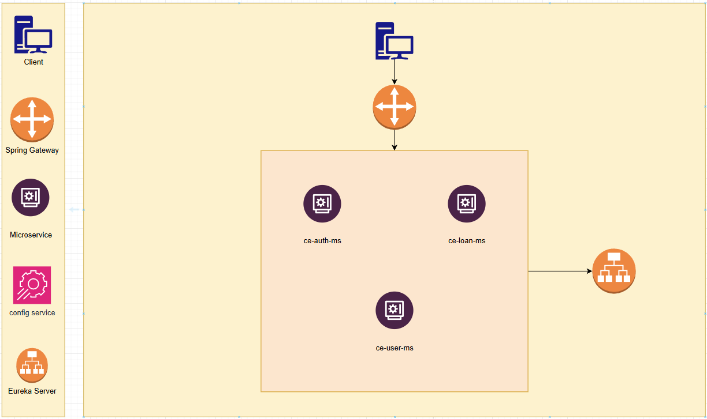
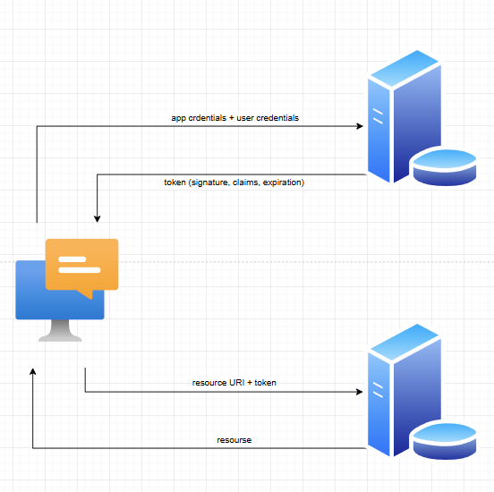
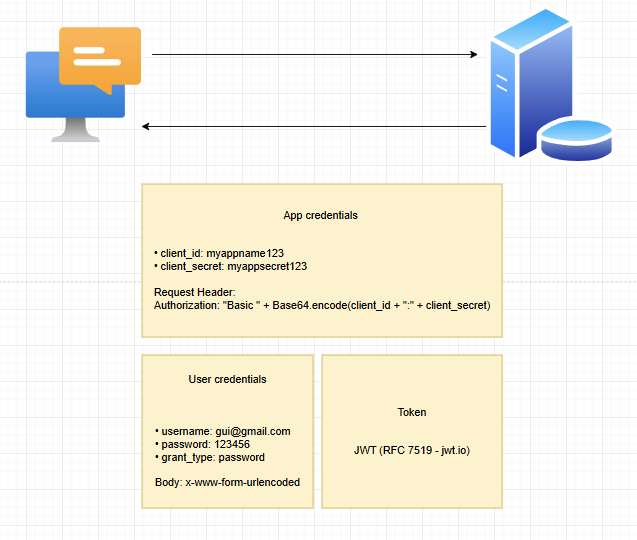

# Sistema de Simulação e Proposta de Empréstimos

## Descrição do Projeto

Este é um microserviço desenvolvido em **Spring Boot** que oferece funcionalidades para simulação de empréstimos personalizados. O sistema calcula taxas de juros baseadas na faixa etária do cliente e fornece informações detalhadas sobre parcelas mensais, juros totais e valor final a ser pago.

## Arquitetura do Sistema

### Visão Geral da Arquitetura

#### Arquitetura dos Microserviços


#### Fluxo de Autenticação JWT


#### Detalhes da Autenticação


## Stack Tecnológica

### Backend
- **Java 21**: Versão LTS mais recente com performance aprimorada
- **Spring Boot 3.5.3**: Framework principal para desenvolvimento rápido
- **Spring Security**: Segurança robusta com JWT
- **Spring Data JPA**: Abstração para acesso a dados
- **PostgreSQL**: Banco de dados principal
- **Maven**: Gerenciamento de dependências

### Qualidade e Documentação
- **Lombok**: Redução de boilerplate code
- **MapStruct**: Mapeamento entre DTOs
- **Swagger/OpenAPI**: Documentação automática da API
- **Spring Actuator**: Monitoramento e métricas
- **JUnit 5**: Framework de testes

#### **JWT (JSON Web Tokens)**
- **Stateless**: Escalabilidade horizontal sem sessões
- **Standard**: Padrão da indústria para autenticação
- **Performance**: Reduz carga no banco de dados

## Padrões de Projeto Implementados

### 1. **Strategy Pattern**
**Localização**: `service.strategy` package

**Propósito**: Calcular taxas de juros baseadas na idade do cliente

```java
- YoungAgeStrategy (até 25 anos): 5% ao ano
- AdultAgeStrategy (26-40 anos): 3% ao ano  
- MatureAgeStrategy (41-60 anos): 2% ao ano
- SeniorAgeStrategy (60+ anos): 4% ao ano
```

**Vantagens**:
- Facilita adição de novas faixas etárias
- Código mais limpo e testável
- Princípio Aberto/Fechado (SOLID)

### 2. **Factory Pattern**
**Localização**: `service.factory.LoanTaxStrategyFactory`

**Propósito**: Criar instâncias das estratégias de taxa baseadas na idade

### 4. **Repository Pattern**
**Localização**: Implementado via Spring Data JPA

**Propósito**: Abstração do acesso a dados

## Segurança

### Autenticação e Autorização

#### **JWT (JSON Web Tokens)**
```java
1. Cliente envia credenciais → /auth/login
2. Sistema valida e gera JWT
3. Cliente inclui token no header: Authorization: Bearer <token>
4. Filtro JWT valida token em cada requisição
```

## Escalabilidade e Performance

### Estratégias de Escalabilidade

#### **1. Escalabilidade Horizontal**
- **Stateless Design**: Sem estado entre requisições
- **Load Balancing**: Distribuição de carga entre instâncias

#### **2. Otimizações de Performance**
```java
- Async Processing para alta volumetria
- Lazy Loading em JPA
```

## 📚 API Documentation

### Endpoint Principal

#### **POST /simulate**
Realiza simulação de empréstimo baseada nos dados do cliente.

**Request:**
```json
{
  "loanValue": 10000.00,
  "birthDate": "1990-05-15",
  "months": 36
}
```

**Response:**
```json
{
  "totalAmount": 11500.00,
  "monthlyInstallment": 319.44,
  "interestPaid": 1500.00
}
```

#### **Códigos de Status**
- `200 OK`: Simulação realizada com sucesso
- `400 Bad Request`: Dados de entrada inválidos
- `401 Unauthorized`: Token JWT inválido ou ausente
- `500 Internal Server Error`: Erro interno do servidor

### Validações de Entrada
- `loanValue`: Valor mínimo R$ 1,00
- `birthDate`: Formato YYYY-MM-DD
- `months`: Mínimo 1 mês

## 🧮 Cálculos Financeiros

### Fórmula de Parcelas Fixas (PMT)
```
PMT = PV × [r(1+r)ⁿ] / [(1+r)ⁿ-1]

Onde:
- PMT = Pagamento mensal
- PV = Valor presente (empréstimo)
- r = Taxa de juros mensal (taxa anual / 12)
- n = Número total de pagamentos (meses)
```

### Taxa de Juros por Faixa Etária
- **Até 25 anos**: 5% ao ano
- **26 a 40 anos**: 3% ao ano
- **41 a 60 anos**: 2% ao ano
- **Acima de 60 anos**: 4% ao ano

## Como Executar o Projeto

### Pré-requisitos
- Java 21+
- Maven 3.8+
- PostgreSQL 12+ (opcional, H2 para desenvolvimento)

### Configuração Local

#### 2. **Configure o Banco de Dados**
```properties
# application.properties
spring.datasource.url=jdbc:postgresql://localhost:5432/loan_db
spring.datasource.username=your_username
spring.datasource.password=your_password
```

#### 3. **Execute o Projeto**
```bash
# Via Maven
mvn spring-boot:run

# Via Java
mvn clean package
java -jar target/ce-loan-ms-0.0.1-SNAPSHOT.jar
```

### Usando Docker

#### **Dockerfile**
```dockerfile
FROM openjdk:21-jdk-slim
COPY target/ce-loan-ms-0.0.1-SNAPSHOT.jar app.jar
EXPOSE 8080
ENTRYPOINT ["java", "-jar", "/app.jar"]
```

#### **Docker Compose**
```yaml
version: '3.8'
services:
  app:
    build: .
    ports:
      - "8080:8080"
    environment:
      - SPRING_PROFILES_ACTIVE=docker
    depends_on:
      - postgres
  
  postgres:
    image: postgres:15
    environment:
      - POSTGRES_DB=loan_db
      - POSTGRES_USER=user
      - POSTGRES_PASSWORD=password
    volumes:
      - postgres_data:/var/lib/postgresql/data
```
